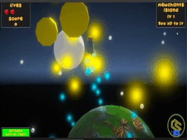

<h3 align="center">I'm Sneakz the software engineer/game developer</h3>

###

  
  
  

###

<h4 align="center">A few cool games I've built, click to test them out:</h4>

  <table>
    <tr>
      <td style="text-align: center; padding-right: 20px;">
        <h5><a href="https://chainsafe.github.io/BlockRacersGame/" target="_blank">Block Racers</a></h5>
        
      </td>
      <td style="text-align: center;">
        <h5><a href="https://chainsafe.github.io/mewchants-island-adventure-game/" target="_blank">Mewchant's Island Adventure</a></h5>
        
      </td>
    </tr>
  </table>

###

<h4 align="center">The tech i'm familiar with:</h4>

###

  
  
  
  
  
  
  
  
  
  
  
  
  
  
  
  
  

###
